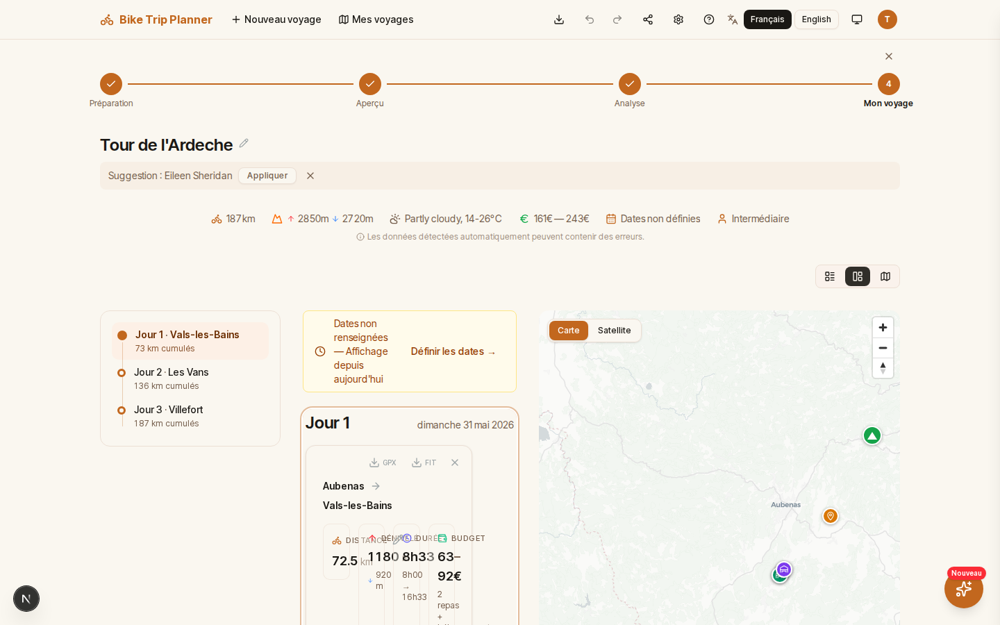
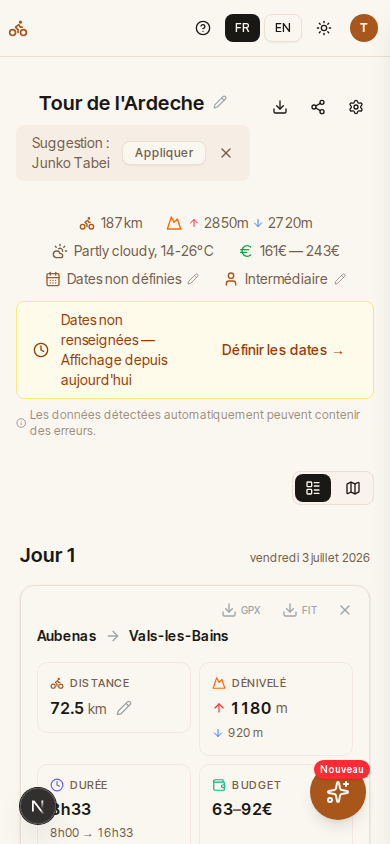

<h1 align="center">Bike Trip Planner</h1>

<p align="center">
  <strong>Plan your bikepacking adventures with confidence.</strong>
</p>

<p align="center">
  Paste a Komoot URL or upload a GPX file, and get a structured day-by-day roadbook<br />
  with smart pacing, safety alerts, and accommodation suggestions.
</p>

<p align="center">
  <a href="https://github.com/vincentchalamon/bike-trip-planner/blob/main/LICENSE"></a>
  
  
  
  
  
  
  
</p>

---

## Screenshots

> **Desktop** — Split view with day-by-day timeline, contextual alerts, and interactive map.

# TODO update screenshot with latest features



> **Mobile** — Responsive timeline with weather, difficulty badge, and supply points.

# TODO update screenshot with latest features and mobile simulation

<p align="center">
  
</p>

---

## Features

**Import your route in seconds** — Paste a link from Komoot, Strava, or RideWithGPS, or upload a GPX file directly. The backend fetches, parses, and processes everything asynchronously.

**Smart pacing engine** — Automatically distributes distance across days, accounting for cumulative fatigue and elevation gain. Configurable daily targets with a safety minimum threshold.

**20+ safety & comfort alerts** — A rule-based alert engine analyzes each stage for steep gradients, dangerous traffic, headwinds, surface quality, e-bike range, sunset timing, resupply gaps, and more — with three severity levels (critical, warning, nudge).

**Accommodation finder** — Discovers bivouac spots, refuges, and gites near each stage endpoint via OpenStreetMap, with heuristic pricing estimates.

**Cultural points of interest** — Detects museums, monuments, castles, viewpoints, and other attractions along the route with an "add to itinerary" action.

**Real-time processing** — Async workers compute your trip in parallel; live status updates stream to the browser via Mercure SSE. No page reload needed.

**Multi-format export** — Export enriched GPX files with waypoints for accommodation, water points, and POIs — ready for your GPS device. Download per-stage FIT files for Garmin, or generate a text roadbook summary.

---

## Supported route sources

| Platform | Supported URL formats |
|---|---|
| **Komoot** | `komoot.com/[xx-xx/]tour/123` and `komoot.com/[xx-xx/]collection/123` |
| **Strava** | `strava.com/routes/123` |
| **RideWithGPS** | `ridewithgps.com/routes/123` |
| **GPX upload** | Direct file upload (up to 15 MB) |

---

## Quick start

```bash
git clone https://github.com/vincentchalamon/bike-trip-planner.git
cd bike-trip-planner
make start-dev
```

The app is available at:

- **<https://localhost>** — Web application
- **<https://localhost/docs>** — API documentation (Swagger UI)

See [Getting Started](docs/getting-started.md) for prerequisites and detailed setup instructions.

---

## Alert engine

# TODO show examples with color

The backend runs a pipeline of analyzers on each stage. Three severity levels are used:

| Level | Color | Description |
|-------|-------|-------------|
| `critical` | Red | Blocking issue requiring immediate attention |
| `warning` | Orange | Significant issue to watch |
| `nudge` | Blue | Informational suggestion |

Rules are executed in priority order (lower = higher priority):

# TODO use color for severity column

| Rule | Priority | Severity | Trigger |
|------|----------|----------|---------|
| **Continuity** | 5 | critical | Gap > 500 m between consecutive stages |
| **Continuity** | 5 | warning | Gap 100-500 m between stages |
| **Elevation** | 10 | warning | Elevation gain > 1 200 m on a stage |
| **Steep gradient** | 20 | warning | Sustained >= 8 % gradient over >= 500 m |
| **Surface** | 20 | warning | Unpaved section >= 500 m (gravel, dirt, mud, grass, sand...) |
| **Surface** | 20 | warning | OSM surface data missing on >= 30 % of ways |
| **Traffic** | 20 | critical | Primary/trunk road without cycle infrastructure >= 500 m |
| **Traffic** | 20 | warning | Secondary road, no cycleway, speed limit > 50 km/h |
| **Traffic** | 20 | nudge | Secondary road, speed limit <= 50 km/h |
| **E-bike range** | 20 | warning | Day distance > effective range (80 km - elevation / 25) |
| **Sunset** | 20 | warning | Estimated arrival time exceeds civil twilight end at stage end point |
| **Calendar** | -- | nudge | Stage falls on a French public holiday |
| **Calendar** | -- | nudge | Stage falls on a Sunday (businesses may be closed) |
| **Wind** | -- | warning | Headwind >= 25 km/h on >= 60 % of stages with weather data |
| **Comfort** | -- | warning | Poor comfort index (< 40/100) on at least one stage |
| **Bike shops** | -- | nudge | No repair shop within 2 km of stage midpoint (trips > 5 stages) |
| **Bike shops** | -- | nudge | Nearby shop sells bikes but does not offer repair service |
| **Resupply** | -- | nudge | Stage >= 40 km with no food/resupply POI along the route |
| **Resupply** | -- | warning | All resupply POIs on the stage are closed at estimated passage time |
| **Accommodation** | -- | warning | All detected accommodations on the stage are likely closed due to seasonality |
| **Water points** | -- | nudge | Stretch > 30 km without a detected drinking water source |
| **Rest day** | 100 | nudge | Every N consecutive cycling days without a rest day (default: every 3 days) |
| **Cultural POI** | -- | nudge | Museum, monument, castle, church, viewpoint, or attraction within 500 m of route |

**Terrain rules** (Continuity, Elevation, Steep gradient, Surface, Traffic, E-bike range, Sunset, Rest day) implement `StageAnalyzerInterface` and are auto-discovered via `#[AutoconfigureTag('app.stage_analyzer')]`. Rules with `--` priority (Calendar, Wind + Comfort, Bike shops, Resupply, Accommodation, Water points, Cultural POI) are separate async Symfony Message handlers; Comfort is co-located with Wind inside `AnalyzeWindHandler`.

---

## Architecture overview

<!-- markdownlint-disable MD040 -->
```
Browser (Next.js 16)           PHP Backend (API Platform 4.2)
  Zustand + Immer (in-memory)    Stateless computation
  Zod validation                 GPX parsing + pacing engine
  openapi-fetch (typed)          OSM Overpass + weather APIs
  Mercure SSE (real-time)  <--   Async workers (Symfony Messenger)
                                 Redis cache + Mercure publisher
```

The frontend sends a trip request via REST; the backend processes it asynchronously across multiple workers and pushes status updates via Mercure SSE. No database — Redis cache for transient state, filesystem cache for external API responses.

Type safety is enforced end-to-end: PHP DTOs define the schema -> API Platform exports an OpenAPI spec -> `npm run typegen` generates TypeScript types -> `openapi-fetch` provides type-safe API calls. A schema change on the backend intentionally causes a TypeScript compilation failure.

---

## Tech stack

| Layer | Technology |
|---|---|
| Backend | PHP 8.5, Symfony 8, API Platform 4.3, Caddy |
| Frontend | Next.js 16 (App Router), React 19, TypeScript (strict) |
| State | Zustand + Immer (in-memory), Mercure SSE (real-time) |
| Styling | Tailwind CSS |
| Testing | PHPUnit 13 (backend), Playwright 1.58 (E2E) |
| Quality | PHPStan level 9, PHP-CS-Fixer, ESLint, Prettier |
| Async | Symfony Messenger, Redis transport, 5 workers |
| Runtime | Docker (Caddy, Mercure, Redis, Node) |

---

## Documentation

| Document | Description |
|---|---|
| [Getting Started](docs/getting-started.md) | Requirements, installation, and local setup |
| [Contributing](docs/contributing.md) | Development workflow, standards, and tooling |
| [Architecture Decisions](docs/adr/) | 21 ADRs explaining every major technical choice |
| [Claude Code Tooling](docs/claude-code-tooling.md) | MCP servers, hooks, and skills for AI-assisted development |

---

## Contributing

Contributions are welcome! Please read the [Contributing Guide](docs/contributing.md) before submitting a pull request.

```bash
make start-dev    # Boot Docker environment
make qa           # Run full QA suite (linting, static analysis, formatting)
make test         # Run all tests (QA + PHPUnit + Playwright)
```

---

## License

This project is licensed under the [GNU Affero General Public License v3.0](LICENSE).
