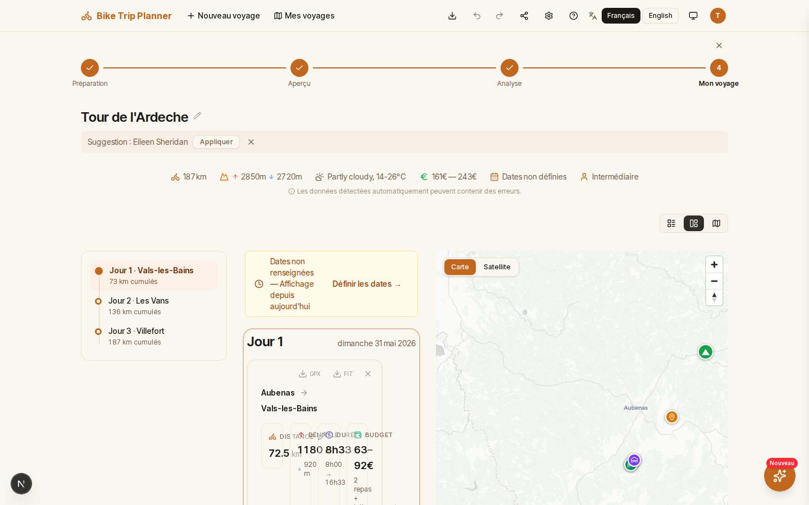
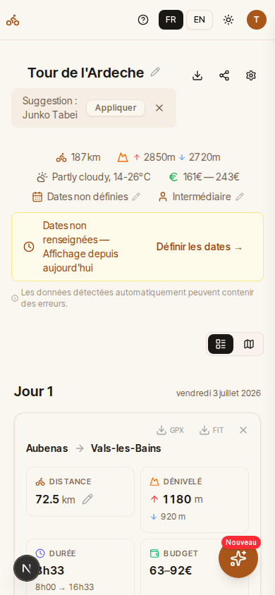

<h1 align="center">Bike Trip Planner</h1>

<p align="center">
  <strong>Plan your bikepacking adventures with confidence.</strong>
</p>

<p align="center">
  Paste a Komoot URL or upload a GPX file, and get a structured day-by-day roadbook<br />
  with smart pacing, safety alerts, and accommodation suggestions.
</p>

<p align="center">
  <a href="https://github.com/vincentchalamon/bike-trip-planner/actions/workflows/ci.yml"></a>
  <a href="https://github.com/vincentchalamon/bike-trip-planner/blob/main/LICENSE"></a>
  
  
  
  
  
  
  
</p>

---

## Screenshots

> **Desktop** — Split view with day-by-day timeline, contextual alerts, and interactive map.



> **Mobile** — Responsive timeline with weather, difficulty badge, and supply points.

<p align="center">
  
</p>

---

## Features

**Import your route in seconds** — Paste a link from Komoot, Strava, or RideWithGPS, or upload a GPX file directly. The backend fetches, parses, and processes everything asynchronously.

**Smart pacing engine** — Automatically distributes distance across days, accounting for cumulative fatigue and elevation gain. Configurable daily targets with a safety minimum threshold.

**20+ safety & comfort alerts** — A rule-based alert engine analyzes each stage for steep gradients, dangerous traffic, headwinds, surface quality, e-bike range, sunset timing, resupply gaps, and more — with three severity levels (critical, warning, nudge).

**Accommodation finder** — Discovers bivouac spots, refuges, and gites near each stage endpoint via OpenStreetMap, with heuristic pricing estimates.

**Cultural points of interest** — Detects museums, monuments, castles, viewpoints, and other attractions along the route with an "add to itinerary" action.

**Real-time processing** — Async workers compute your trip in parallel; live status updates stream to the browser via Mercure SSE. No page reload needed.

**AI trip analysis (optional, bring-your-own token)** — Off by default and fully opt-in. Enable it in your account settings by choosing a provider — Anthropic (Claude), Google (Gemini), or OpenAI — and pasting your own API key. Your key powers per-stage and whole-trip summaries and a context-aware chat assistant, including an in-ride mode that surfaces nearby points of interest. The key is encrypted at rest and never returned by the API. When AI is on, trip data (route, towns, dates) is sent to your chosen provider with your own key and billed to your account; nothing leaves to a third party unless you opt in. It degrades gracefully: with no key, a bad key, a quota wall, or a provider outage, the rule-based alerts stay fully visible.

**Multi-format export** — Export enriched GPX files with waypoints for accommodation, water points, and POIs — ready for your GPS device. Download per-stage FIT files for Garmin, or generate a text roadbook summary.

**Your account, your data** — Passwordless magic-link sign-in. Export all your data as JSON or irreversibly delete your account at any time. Privacy-friendly, cookieless analytics (self-hosted Plausible) — no third-party trackers.

---

## Supported route sources

| Platform | Supported URL formats |
|---|---|
| **Komoot** | `komoot.com/[xx-xx/]tour/123` and `komoot.com/[xx-xx/]collection/123` |
| **Strava** | `strava.com/routes/123` |
| **RideWithGPS** | `ridewithgps.com/routes/123` |
| **GPX upload** | Direct file upload (up to 30 MB) |

---

## Supported OSM accommodation tags

| Logical type | OSM query | Pricing heuristic |
|---|---|---|
| `hotel` | `tourism=hotel` | €50–€120 |
| `guest_house` | `tourism=guest_house` | €40–€80 |
| `chalet` | `tourism=chalet` | €30–€70 |
| `hostel` | `tourism=hostel` | €20–€35 |
| `alpine_hut` | `tourism=alpine_hut` | €25–€45 |
| `camp_site` | `tourism=camp_site` | €8–€25 (€8–€15 if `backpack=yes` or `tents=yes`) |
| `wilderness_hut` | `tourism=wilderness_hut` | free / donation (€0–€10) |

Every type above is enabled on a new trip. Three types were removed in #927:
`shelter` (`amenity=shelter`) because [the measurement](docs/audit/878-hebergements-osm-sans-nom.md)
found 76% of it to be street furniture — bus shelters above all — so it now feeds
the in-ride "where can I take cover" intent only, and never lodging; `motel`
because `tourism=motel` is a north-American concept, empty in France; and `rental`
(meublé de tourisme) because that market is let by the week and neither source
carries a minimum-stay field.

Since #884, a bookable accommodation that arrives without a name is **not imported**
rather than filtered out when read. The provisioner first tries to complete it — the
a geometric match against the curated DataTourisme flux (same category, within 50 m), then
the Wikidata label when the row carries a Q-ID, then `operator`, then `brand`, the tag-based
ones qualified by the commune resolved offline from the imported boundaries ("Camping
municipal — Sarlat") — and a per-category `CHECK` refuses what is left.

The geometric match is what the runtime deduplicator structurally cannot do: it pairs
places **by name**, so the one thing it needs is the one thing missing. At import there is
no such constraint, and DataTourisme names every one of its 124 240 accommodations. Two
curated candidates in range produce a **rejection**, never a pick — attributing the wrong
name is worse than attributing none — and each accepted match records the record it came
from and its distance, for audit. The 50 m radius is a starting point; `/api/health` reports
the match and ambiguity counts per run, which is what will confirm or move it. The one exemption is `shelter`, whose
useful sorting key is `shelter_type`, not the name. Categories a rider can act on from
coordinates alone (water points, fords, ferries) and generic POIs carry no such
constraint. See [ADR-049](docs/adr/adr-049-zone-opening-and-import-time-completeness.md).

The bracket above is the *unrated* estimate. A `charge` tag or a numeric `fee` overrides it with an exact price, `fee=no` prices the entry as free, and a known `stars` rating lifts the bracket floor by 25% of its span per star above 2, capped at 75% (a 4-star hotel is estimated €85–€120, not €50–€120).

Only a few candidates are kept per stage: they are ranked by **completeness** (website, description, opening hours, Wikidata Q-ID, stars, capacity, tag richness) with the price as tiebreaker, and a per-family cap reserves one slot for the outdoor family (camping, wilderness hut) so a stage never returns hotels only.

---

## Quick start

```bash
git clone https://github.com/vincentchalamon/bike-trip-planner.git
cd bike-trip-planner
make start-dev
```

The app is available at:

- **<https://localhost>** — Web application
- **<https://localhost/docs>** — API documentation (Swagger UI)

See [Getting Started](docs/getting-started.md) for prerequisites and detailed setup instructions.

---

## Alert engine

The backend runs a pipeline of analyzers on each stage. Three severity levels are used:

| Level | Badge | Description |
|-------|-------|-------------|
| `critical` |  | Blocking issue requiring immediate attention |
| `warning` |  | Significant issue to watch |
| `nudge` |  | Informational suggestion |

Every alert carries a stable `code` (`App\Enum\AlertCode`) identifying the rule
variant that raised it, independent of the message wording. The frontend keys
dismissals and deduplication on that code, so rephrasing a message never
resurfaces a dismissed alert. **One row below per code** — `AlertDocumentationTest`
fails if a code is emitted without a row, or if a row documents a code no longer
emitted.

Rules are executed in priority order (lower = higher priority):

| Rule | Code | Priority | Severity | Trigger |
|------|------|----------|----------|---------|
| **Continuity** | `continuity_gap_critical` | 5 |  | Gap > 500 m between consecutive stages |
| **Continuity** | `continuity_gap_warning` | 5 |  | Gap 100-500 m between stages |
| **Elevation** | `elevation_gain` | 10 |  | Elevation gain > 1 200 m on a stage |
| **Steep gradient** | `steep_gradient` | 20 |  | Sustained >= 8 % gradient over >= 500 m |
| **Surface** | `surface_rough` | 20 |  | Rough surface section >= 500 m: unpaved (gravel, dirt, mud, sand...) or rough paved (sett, cobblestone, paving stones); composite values like `gravel;dirt` count, and `tracktype=grade3..5` / `smoothness=bad..impassable` are used as a fallback when `surface` is absent |
| **Traffic** | `traffic_main_road` | 20 |  | Primary/trunk road without cycle infrastructure >= 500 m |
| **Traffic** | `traffic_secondary_road_fast` | 20 |  | Secondary road, no cycleway, `maxspeed` tagged and > 50 km/h |
| **Traffic** | `traffic_secondary_road_slow` | 20 |  | Secondary road, no cycleway, `maxspeed` <= 50 km/h or absent/unreadable |
| **E-bike range** | `ebike_range_exceeded` | 20 |  | Day distance > effective range (80 km - elevation / 25); action navigates to the nearest charging station within 2 km, else suggests shortening the stage |
| **Sunset** | `sunset_arrival_after_twilight` | 20 |  | Estimated arrival time exceeds civil twilight end at stage end point (times shown in the stage's local timezone) |
| **Calendar** | `calendar_public_holiday` | -- |  | Stage falls on a public holiday of a country the route crosses, for any year the trip spans (France as fallback when no boundary resolves). Named and unnamed holidays share this code |
| **Calendar** | `calendar_sunday` | -- |  | Stage falls on a Sunday (businesses may be closed) |
| **Wind** | `wind_headwind` | -- |  | Headwind >= 25 km/h on >= 60 % of stages with weather data |
| **Comfort** | `comfort_poor_conditions` | -- |  | Poor comfort index (< 40/100) on at least one stage |
| **Bike shops** | `bike_shop_none_nearby` | -- |  | No repair resource within 2 km of stage midpoint (trips > 5 stages) |
| **Resupply** | `resupply_none_on_stage` | -- |  | Stage >= 40 km with no food/resupply POI along the route |
| **Resupply** | `resupply_closed_at_passage` | -- |  | All resupply POIs on the stage are known to be closed at estimated passage time (a POI whose OpenStreetMap `opening_hours` is missing or unparsable is treated as unknown and suppresses the warning) |
| **Accommodation** | `accommodation_seasonal_closure` | -- |  | All detected accommodations on the stage are likely closed due to seasonality |
| **Water points** | `water_point_gap` | -- |  | Stretch > 30 km without a detected drinking water source |
| **Rest day** | `rest_day_suggested` | 100 |  | Every N consecutive cycling days without a rest day (default: every 3 days), except on the trip's last day or when the following day is already a rest day |
| **Cultural POI** | `cultural_poi_suggestion` | -- |  | Museum, monument, castle, church, viewpoint, or attraction within 500 m of route — enriched with opening hours, price and description when sourced from DataTourisme. Named and unnamed POIs share this code |
| **Railway station** | `railway_station_none_nearby` | -- |  | No train station within 10 km of a stage endpoint (emergency evacuation) |
| **Health services** | `health_service_none_nearby` | -- |  | No pharmacy, hospital, or clinic within 15 km of a stage |
| **Border crossing** | `border_crossing` | -- |  | Route crosses an international border (country change detected via the local PostGIS admin-boundary index) |
| **Ferry** | `ferry_crossing` | -- |  | Stage takes a ferry crossing (route runs within 100 m of an `osm.ferries` line; check schedule/booking) |
| **Ford** | `ford_crossing_dry` | -- |  | Stage crosses a ford (`osm.fords` within 25 m of the route), dry weather |
| **Ford** | `ford_crossing_wet` | -- |  | Stage crosses a ford and rain is forecast (precipitation probability >= 50 %): possibly impassable in high water |

**Terrain rules** (Continuity, Elevation, Steep gradient, Surface, Traffic, E-bike range, Sunset, Rest day) implement `StageAnalyzerInterface` and are auto-discovered via `#[AutoconfigureTag('app.stage_analyzer')]`. Rules with `--` priority (Calendar, Wind + Comfort, Bike shops, Resupply, Accommodation, Water points, Cultural POI, Railway station, Health services, Border crossing, Ferry, Ford) are separate async Symfony Message handlers; Comfort is co-located with Wind inside `AnalyzeWindHandler`. Ford runs after the weather computation (its severity depends on the per-stage forecast).

**Rest days** are skipped by every rule that describes riding (Elevation, Steep gradient, Surface, Traffic, E-bike range, Sunset, Bike shops, Water points, Resupply). Three rules run on rest days on purpose: Continuity (a rest day duplicates the previous stage's end point, so its check is the real gap between the two ridden stages around it), Health services (evaluated at the stage midpoint, i.e. where the rider stays all day) and Calendar (a holiday closes shops whether or not you pedal).

---

## Architecture overview

<!-- markdownlint-disable MD040 -->
```
Browser (Next.js 16)           PHP Backend (API Platform 4.3)
  Zustand + Immer (in-memory)    Stateless computation
  Zod validation                 GPX parsing + pacing engine
  openapi-fetch (typed)          Local PostGIS reference index + weather
  Mercure SSE (real-time)  <--   Async workers (Symfony Messenger)
                                 Redis cache + Mercure publisher
```

The frontend sends a trip request via REST; the backend processes it asynchronously across multiple workers and pushes status updates via Mercure SSE. PostgreSQL 18 persists trip configuration and stages; Redis handles transient computation state, Messenger transport, and external API caches.

Type safety is enforced end-to-end: PHP DTOs define the schema -> API Platform exports an OpenAPI spec -> `npm run typegen` generates TypeScript types -> `openapi-fetch` provides type-safe API calls. A schema change on the backend intentionally causes a TypeScript compilation failure.

---

## Tech stack

| Layer | Technology |
|---|---|
| Backend | PHP 8.5, Symfony 8, API Platform 4.3, Caddy |
| Frontend | Next.js 16 (App Router), React 19, TypeScript (strict) |
| State | Zustand + Immer (in-memory), Mercure SSE (real-time) |
| Styling | Tailwind CSS |
| Testing | PHPUnit 13 (backend), Playwright 1.62 (E2E) |
| Quality | PHPStan level 9, PHP-CS-Fixer, ESLint, Prettier |
| Async | Symfony Messenger, Redis transport, 5 workers |
| Runtime | Docker (Caddy, Mercure, Redis, PostgreSQL, Node) |

---

## Documentation

| Document | Description |
|---|---|
| [Documentation index](docs/README.md) | Find docs by what you need: learn, do, look up, understand |
| [Getting Started](docs/getting-started.md) | Requirements, installation, and local setup |
| [Contributing](docs/contributing.md) | Development workflow, standards, and tooling |
| [Deployment](docs/deployment.md) | CI/CD pipeline, required secrets, rollback procedure |
| [Architecture Decisions](docs/adr/) | 47 ADRs explaining every major technical choice |
| [Runbooks](docs/runbooks/) | On-call playbooks: workers, DB, Redis, Mercure, releases |
| [Claude Code Tooling](docs/claude-code-tooling.md) | MCP servers, hooks, and skills for AI-assisted development |
| [Architecture](docs/architecture.md) | System overview and the reasoning behind the ADRs |
| [Legal & Licensing](docs/legal-and-licensing.md) | Project licence, data attribution, and GDPR posture |

---

## External data sources

| Source | Role | Licence | Coverage | Prerequisite |
|--------|------|---------|----------|-------------|
| **OpenStreetMap** | Primary: roads, bike infra, water points, bike shops, resupply, base POIs & accommodations | [ODbL](https://opendatacommons.org/licenses/odbl/) | Global | None |
| **DataTourisme** | Complementary: enriched accommodations and cultural POIs; exclusive: dated events | [Licence Ouverte 2.0](https://www.etalab.gouv.fr/licence-ouverte-open-licence) | France | `DATATOURISME_API_KEY` |
| **Wikidata** | Cross-cutting enricher: multilingual descriptions, images, Wikipedia links via Q-IDs | [CC0](https://creativecommons.org/publicdomain/zero/1.0/) | Europe | None |

### OpenStreetMap

All geographic and infrastructure data is derived from [OpenStreetMap](https://www.openstreetmap.org). The provisioner imports OSM extracts into a local PostGIS reference index that the API queries directly with spatial predicates (`ST_DWithin` / `ST_Covers`); there is no runtime Overpass dependency. See [ADR-040](docs/adr/adr-040-local-first-reference-data-postgis.md).

**Licence:** [ODbL 1.0](https://opendatacommons.org/licenses/odbl/) — attribution required: "© OpenStreetMap contributors".

#### OSM provisioning and refresh

OSM feeds **two independent datasets**, on two grains and two calendars — they share no file and no command:

| | Reference (PostGIS) | Routing (Valhalla) |
|---|---|---|
| Answers | what is near this track? | can we go from A to B? |
| Grain | region (`nord-pas-de-calais`) | country (`france`) |
| Command | `make provision` | `make routing-build france` |
| Cadence | often, one zone at a time | rarely, per country opening |

See [ADR-049](docs/adr/adr-049-zone-opening-and-import-time-completeness.md) for the import model (zone opening, transactional promotion, import-time completeness gate, append-only storage), [ADR-020](docs/adr/adr-020-dynamic-overpass-region-provisioning.md) and [ADR-036](docs/adr/adr-036-manual-osm-data-refresh.md) for the refresh rationale, and [the routing-graph runbook](docs/runbooks/valhalla-routing-graph.md) for the build + upload procedure.

**Opening a zone (one zone per run):**

```bash
make provision bretagne
```

The zone is a **mandatory argument** — a Geofabrik slug or display name. The `provision` command runs inside the `provisioner` container (Compose profile `provisioning`) and loads **all reference sources** for that one zone:

- **OSM + PostGIS** — downloads that zone's Geofabrik extract into the shared `/data` volume, tags-filters it, imports the bikepacking-relevant OSM features (POI, accommodations, water points) into a staging schema scoped to the zone via `osm2pgsql` (flex style `provisioner/osm2pgsql/tier1.lua`), then promotes into the live `osm` schema the keys it does not already hold — registry row, coverage polygon and metadata included — in one transaction. This local-first reference index is what the API reads via `ST_DWithin` corridor queries — see [ADR-040](docs/adr/adr-040-local-first-reference-data-postgis.md).
- **DataTourisme** — downloads the configured flux and promotes the places covered by that zone into the `tourism` schema. Skipped gracefully (with a warning) when `DATATOURISME_FLUX_ID` / `DATATOURISME_APP_KEY` are absent, so OSM still provisions.

Three properties of that model (ADR-049), all of them checkable from the command's own report:

- **Opening a second zone keeps the first.** Promotion is an `INSERT ... SELECT` restricted to keys absent from the live tables, never a schema swap, so no other zone is exposed to the run.
- **Re-opening an unchanged zone inserts 0 rows** and rewrites nothing. `last_seen_at` is the single exception, and it is metadata; the payload of an imported row is never overwritten.
- **A zone the routing graph does not cover is refused**, before anything is downloaded, with the `make routing-build <country>` command to run first. The provisioner reads the routing volume read-only to observe that perimeter, and records it so `/api/health` reports the containment invariant.

`osm.zones` is the source of truth for what is open; there is no selection file.

Each opening also writes `.docker/osm/data/zones/<zone>/rejected.tsv`: what the completeness
gate refused, **ranked by distance to the nearest signed cycle route**, so an operator works
the thirty refusals that border a véloroute rather than the three thousand lost in open
country. Corrections go back in as an `override.tsv` via `make provision-override <zone>` —
no endpoint, no interface, no versioning, and nothing stores the file. See the
[corrections runbook](docs/runbooks/zone-opening-corrections.md).

**Refresh (manual):**

Both datasets are refreshed manually — there is no scheduled job — and independently:

```bash
make provision bretagne          # reference: re-open one zone, picking up what
                                 # OSM has gained since (0 new rows if nothing did)
make routing-build france        # routing: rebuild the graph for the perimeter
```

`make routing-build` runs the one-shot `valhalla-builder` (Compose profile `routing-build`): it downloads the national extracts into the `valhalla-tiles` volume, rebuilds tiles + elevation + admin + timezone data, then exits. The `valhalla` service only ever serves that result, so a long or failed build cannot take routing down. Because routing needs a graph that no clean checkout has, it is opt-in: `make start-dev` does not start it, `make routing-up` does.

**Iso-prod recette stack:**

`make provision <zone>` inherits the dev `COMPOSE_FILE` and targets the dev provisioner overlay. To provision against the iso-prod recette stack started with `make start-recette`, use the dedicated target instead:

```bash
make provision-recette nord-pas-de-calais    # open one zone on the recette index
```

It targets `-f compose.yaml -f compose.recette.yaml`. The recette JWT keys and passphrase are wired in `compose.recette.yaml` (no `JWT_*` passed on the command line), and the `prod` / `dev` provisioner images now carry distinct tags (`bike-trip-planner-provisioner:prod` vs `:dev`), so the previous forced `--build` is no longer needed. Like `make provision`, it loads OSM + DataTourisme and takes the zone as a mandatory argument — no seed file, and nothing to prepare beyond a routing graph covering the zone's country.

See [ADR-036](docs/adr/adr-036-manual-osm-data-refresh.md) for why the automated nightly job (`osm-cron`) was dropped.

### DataTourisme

[DataTourisme](https://www.datatourisme.fr) provides enriched POI data (accommodations, cultural sites, dated events) for France. It is used as an optional supplementary source alongside OpenStreetMap. What the flux actually carries — fill rates per object type, Accueil Vélo coverage, pricing granularity — is measured in the [DataTourisme flux field audit](docs/datatourisme-flux-audit.md).

**Licence:** [Licence Ouverte 2.0 Etalab](https://www.etalab.gouv.fr/licence-ouverte-open-licence) — commercial use and modification permitted; attribution required.

**Quota:** 1 000 requests/hour, ~10 req/s sustained. Rate limiting is enforced server-side via a `fixed_window` limiter.

**Registration:** [https://www.datatourisme.fr/](https://www.datatourisme.fr/) — free sign-up, personal API key delivered by email.

To enable DataTourisme integration, set the following environment variables:

```env
DATATOURISME_API_KEY=your-api-key
DATATOURISME_ENABLED=true
```

When `DATATOURISME_ENABLED=false` (the default) or the API key is absent, all DataTourisme calls are skipped and the application falls back to OpenStreetMap data exclusively.

### Wikidata

[Wikidata](https://www.wikidata.org) enriches POI, accommodation, and event data already returned by other sources that carry a Wikidata Q-ID (via OSM tag `wikidata=Q12345` or DataTourisme property `owl:sameAs`). Coverage is **European**. Licence is **CC0** — no attribution required.

Fields added: description, Wikimedia Commons thumbnail, Wikipedia article link, and structured opening hours when available.

Enrichment runs **at provision time**, not at request time (ADR-040/041): the provisioner batches the Wikidata SPARQL queries over the bounded set of Q-IDs imported into PostGIS and stores the result in the `osm.*` / `tourism.*` columns, behind a persistent cache (`provisioner.wikidata_cache`). The API reads the enriched columns from the local database — no runtime Wikidata call, no configuration required. A Wikidata outage degrades only the next provisioning refresh, never a user request.

---

## Contributing

Contributions are welcome! Please read the [Contributing Guide](docs/contributing.md) before submitting a pull request.

```bash
make start-dev    # Boot Docker environment
make qa           # Run full QA suite (linting, static analysis, formatting)
make test         # Run all tests (QA + PHPUnit + Playwright)
```

---

## License

This project is licensed under the [GNU Affero General Public License v3.0](LICENSE).
