# Tracking

## Dependency Graph

```mermaid
graph TD
    %% Auth chain
    75["#75 ADR Auth"] --> 76["#76 Auth Backend"]
    76 --> 77["#77 Securisation Endpoints"]
    76 --> 79["#79 Frontend Auth"]
    76 --> 65["#65 Garmin Connect"]
    77 --> 78["#78 Securisation Mercure"]
    77 --> 80["#80 Partage Trip"]

    %% Pacing/time chain
    48["#48 Profil Cyclo"] --> 61["#61 Estimation Temps"]
    61 --> 62["#62 Horaires Soleil"]

    %% Map chain
    30["#30 Carte Interactive"] --> 31["#31 Split View"]

    %% Mobile chain
    52["#52 Verrouillage Trips"] --> 69["#69 Scaffolding Capacitor"]
    53["#53 Creation Trip URL"] --> 69
    69 --> 51["#51 Consultation Mobile"]
    70["#70 i18n Client"] --> 51
    71["#71 URL API Direct"] --> 51
    72["#72 Mode Hors-ligne"] --> 51
    73["#73 CI APK Android"] --> 51
    74["#74 ADR Mobile"] --> 51

    %% Persistence meta-ticket
    50["#50 Liste Trips"] --> 56["#56 Persistance BDD"]
    45["#45 Duplication Trip"] --> 56
    52 --> 56
    42["#42 Bouton Partager"] --> 56
    65 --> 56
    76 --> 56
    77 --> 56
    80 --> 56
    51 --> 56

    %% Styles
    classDef wave1 fill:#d4edda,stroke:#28a745
    classDef wave2 fill:#fff3cd,stroke:#ffc107
    classDef wave3 fill:#f8d7da,stroke:#dc3545

    class 5,26,27,28,29,30,32,33,34,35,36,37,38,39,40,41,42,43,44,45,46,47,48,49,50,52,53,54,55,57,58,59,60,63,64,66,67,70,71,72,73,74,75 wave1
    class 31,61,62,65,69,76,77,79 wave2
    class 51,56,78,80 wave3
```

**Legende :** vert = Wave 1, jaune = Wave 2, rouge = Wave 3.

> **Note :** Dependance circulaire #76 <-> #56 cassee volontairement : l'auth peut etre implementee avec sa propre table users sans attendre la persistance complete.

---

## Wave 1 — Fondations & Tickets Independants

Aucune dependance reelle. Maximisation du parallelisme.

| ID | Titre | Effort | Statut | Branche |
|----|-------|--------|--------|---------|
| #5 | Add unit tests | — | En attente | — |
| #26 | Traduire la documentation en francais | S | En attente | — |
| #27 | Ameliorer la presentation de la documentation | S | En attente | — |
| #28 | Resumer les suggestions et detections | S | En attente | — |
| #29 | Changer la licence (OpenCreative) | S | En attente | — |
| #30 | Carte interactive avec trace et profil altimetrique | XL | En attente | — |
| #32 | Onboarding guide (tour interactif) | S | En attente | — |
| #33 | Raccourcis clavier + bouton Aide | M | En attente | — |
| #34 | Timeline ravitaillement par etape | L | En attente | — |
| #35 | Suggestion de points d'interet culturels | M | En attente | — |
| #36 | Filtre des types d'hebergements | M | En attente | — |
| #37 | Rayon de recherche des hebergements | M | En attente | — |
| #38 | Distance entre l'hebergement et le endPoint | S | En attente | — |
| #39 | Selectionner un hebergement | L | En attente | — |
| #40 | Barre de progression segmentee du trip | M | En attente | — |
| #41 | Badge de difficulte ameliore avec jauge visuelle | S | En attente | — |
| #42 | Bouton Partager (infographie + texte + lien) | L | En attente | — |
| #43 | Meteo etendue avec vent relatif et indice de confort | L | En attente | — |
| #44 | Support multi-langue (fr/en) | L | En attente | — |
| #45 | Duplication de trip | M | En attente | — |
| #46 | Invalidation de messages Messenger | M | En attente | — |
| #47 | Exporter au format texte | S | En attente | — |
| #48 | Profil cyclo configurable + presets | M | En attente | — |
| #49 | Panneau de configuration (sidebar) | M | En attente | — |
| #50 | Liste des trips | L | En attente | — |
| #52 | Verrouillage des trips passes | M | En attente | — |
| #53 | Creation de trip via URL avec parametre link | S | En attente | — |
| #54 | Correction des deniveles sous-estimes | M | En attente | — |
| #55 | Insertion de jours de repos | M | En attente | — |
| #57 | Undo/Redo | L | En attente | — |
| #58 | Detection des points d'eau | M | En attente | — |
| #59 | Budget recapitulatif | S | En attente | — |
| #60 | Support de sources de routes supplementaires | L | En attente | — |
| #63 | Detection des pentes raides | S | En attente | — |
| #64 | Bouton de telechargement GPX global | S | En attente | — |
| #66 | Detecter les points de charge VAE | S | En attente | — |
| #67 | Generer un itineraire (LLaMA 3B) | XL | En attente | — |
| #70 | i18n client-side pour compatibilite export statique | S | En attente | — |
| #71 | Parametrer l'URL API pour acces direct backend | S | En attente | — |
| #72 | Mode hors-ligne avec persistance des donnees trip | L | En attente | — |
| #73 | CI GitHub Actions pour build APK Android | M | En attente | — |
| #74 | ADR : strategie mobile Capacitor | S | En attente | — |
| #75 | ADR : strategie d'authentification passwordless magic link | S | En attente | — |

## Wave 2 — Fonctionnalites Dependantes

| ID | Titre | Effort | Depend de | Statut | Branche |
|----|-------|--------|-----------|--------|---------|
| #31 | Split view carte / timeline | M | #30 | En attente | — |
| #61 | Estimation du temps de parcours | M | #48 | En attente | — |
| #62 | Horaires lever/coucher de soleil + alerte arrivee nocturne | M | #61 | En attente | — |
| #65 | Garmin Connect Courses API | L | #76 | En attente | — |
| #69 | Scaffolding Capacitor et strategie dual build | M | #52, #53 | En attente | — |
| #76 | Auth backend : JWT + magic link passwordless | L | #75 | En attente | — |
| #77 | Securisation des endpoints API Platform (Trip, Stage) | M | #76 | En attente | — |
| #79 | Frontend auth : store, intercepteur API, login, route guards | M | #76 | En attente | — |

## Wave 3 — Polissage & Tickets Complexes

| ID | Titre | Effort | Depend de | Statut | Branche |
|----|-------|--------|-----------|--------|---------|
| #51 | Consultation mobile hors ligne | XL | #69, #70, #71, #72, #73, #74 | En attente | — |
| #56 | Persistance en base de donnees | XL | #50, #45, #52, #76, #77, #80, #42, #65, #51 | En attente | — |
| #78 | Securisation Mercure (subscriber JWT, private updates) | M | #76, #77 | En attente | — |
| #80 | Partage de trip en lecture seule (anonymous) | M | #76, #77 | En attente | — |
