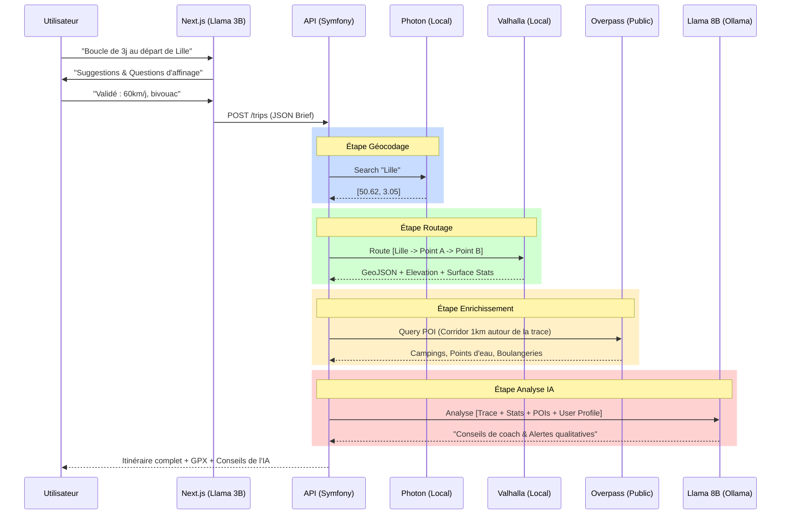

# Architecture Project: Bike Trip Planner AI (2026)

**Stack :** Next.js, Symfony/API Platform, Ollama (LLaMA 3.2 3B & 3.1 8B), Valhalla, Photon.
**Infra :** Oracle Cloud Free Tier (4 OCPUs ARM, 24GB RAM).

---

## 1. Optimisations de l'Infrastructure

### 1.1. Suppression d'Overpass local au profit de l'API Publique

**Problématique :** Un serveur Overpass couvrant la France (ou l'Europe) nécessite entre 16 Go et 64 Go de RAM et un stockage SSD ultra-rapide pour les indexations. Sur une instance Oracle A1 (24 Go total), faire cohabiter Overpass avec Valhalla et deux modèles LLM provoquerait un "OOM Kill" (Out Of Memory) immédiat.

**Solution :** Utilisation de l'API publique (`overpass-api.de`) via une stratégie de **"Corridor de Recherche"**.

* **Efficacité :** Une fois la trace générée par Valhalla, l'API ne requête que les POI situés à moins de 500m ou 1km de la polyligne.
* **Rapidité :** Ces requêtes ciblées sont traitées en millisecondes par les serveurs publics.
* **Économie de ressources :** Libère ~12 Go de RAM sur l'instance Oracle, permettant de garder les modèles LLaMA en mémoire (`keep_alive`).

### 1.2. L'utilité critique de Photon (Geocoding local)

LLaMA sait ce qu'est "Lille", mais il ne connaît pas ses coordonnées exactes au millième près. Valhalla, lui, ne comprend pas le texte, il ne comprend que les coordonnées `[lat, lon]`.

**Rôles de Photon :**

1. **Traducteur Langage -> GPS :** Transforme les noms de villes/lieux saisis dans le prompt en points d'entrée pour Valhalla.
2. **Performance :** Photon est extrêmement léger (basé sur une structure Elasticsearch compressée). Il répond en < 50ms sans quitter votre serveur.
3. **Autonomie :** Permet à l'IA de valider l'existence d'un lieu avant de lancer un calcul d'itinéraire inutile.

---

## 2. Intelligence Artificielle : Stratégie Multi-Modèles

### 2.1. LLaMA 3.2 3B : L'Agent de Dialogue (UX)

Placé côté Next.js, ce modèle gère l'interaction fluide. Son rôle est de transformer une intention floue en un **"Mission Brief"** structuré.

* **Exemple :** Si l'utilisateur dit "Un tour en Belgique", le 3B relance : "Plutôt plat (Flandres) ou vallonné (Ardennes) ? Quel type de vélo ?".
* **Sortie :** Un JSON envoyé à l'API.

### 2.2. LLaMA 3.1 8B : L'Expert Analyste (Logique & Coaching)

Ce modèle intervient après que les scripts ont fait le travail "brut". Il apporte la couche de **jugement qualitatif**.

**Exemples d'analyses à haute valeur ajoutée :**

* **Analyse de Sécurité :** "Le segment km 45-50 utilise une route départementale qui, bien que cyclable, est connue pour son trafic de poids lourds le lundi. Je suggère le détour via la voie verte parallèle."
* **Analyse de Confort :** "Le jour 2 cumule 800m de dénivelé sur les 10 derniers kilomètres. C'est un effort intense en fin de journée ; j'ai identifié un point de repos idéal au km 55."
* **Analyse Contextuelle :** "Vous passez à proximité du Mont Cassel. Le tracé actuel le contourne, mais si vous avez les jambes, le détour de 2km offre la meilleure vue de la région."

---

## 3. Diagramme de Flux de Bout en Bout



---

## 4. Spécifications Techniques des Échanges

### 4.1. Brief de Mission (Next.js -> API)

L'IA 3B consolide la discussion en un objet métier.

```http
POST /api/trips
Content-Type: application/json

{
  "user_id": "123",
  "preferences": {
    "start_point": "Lille",
    "duration_days": 3,
    "daily_distance_km": 60,
    "bike_type": "gravel",
    "experience_level": "intermediate"
  }
}
```

### 4.2. Appel au moteur de stratégie (API -> LLaMA 8B)

L'API demande à l'IA de définir la meilleure configuration pour Valhalla.

```json
// Prompt envoyé à Ollama
{
  "model": "llama3.1:8b",
  "prompt": "Convertis ce besoin en paramètres Valhalla : 3 jours gravel autour de Lille. Répond uniquement en JSON.",
  "format": "json"
}

// Réponse attendue (JSON)
{
  "costing": "bicycle",
  "costing_options": {
    "bicycle": {
      "bicycle_type": "Gravel",
      "use_roads": 0.2,
      "use_hills": 0.5
    }
  }
}
```

### 4.3. Rapport d'analyse final (API -> LLaMA 8B)

Après génération, l'IA reçoit un résumé textuel pour produire son conseil.

```json
{
  "model": "llama3.1:8b",
  "system": "Tu es un expert en cyclotourisme. Analyse l'itinéraire fourni.",
  "prompt": "Itinéraire : Lille-Cassel. Distance: 62km. Surface : 15% pavés. Météo prévue : Vent de face 20km/h. POIs: 2 points d'eau au km 10 et 55. Analyse les risques."
}
```

---

## 5. Recommandations

1. **Prompt Engineering :** Utiliser le mode `json` d'Ollama pour garantir que les sorties de LLaMA sont directement parsables par Symfony.
2. **Gestion d'erreurs :** Prévoir un "Fallback" : si LLaMA 8B échoue ou est trop lent, l'itinéraire de Valhalla doit quand même être affiché avec les données brutes des scripts.
3. **Context Window :** Configurer la `num_ctx` à 8192 minimum dans Ollama pour permettre l'analyse de listes de POI volumineuses.
