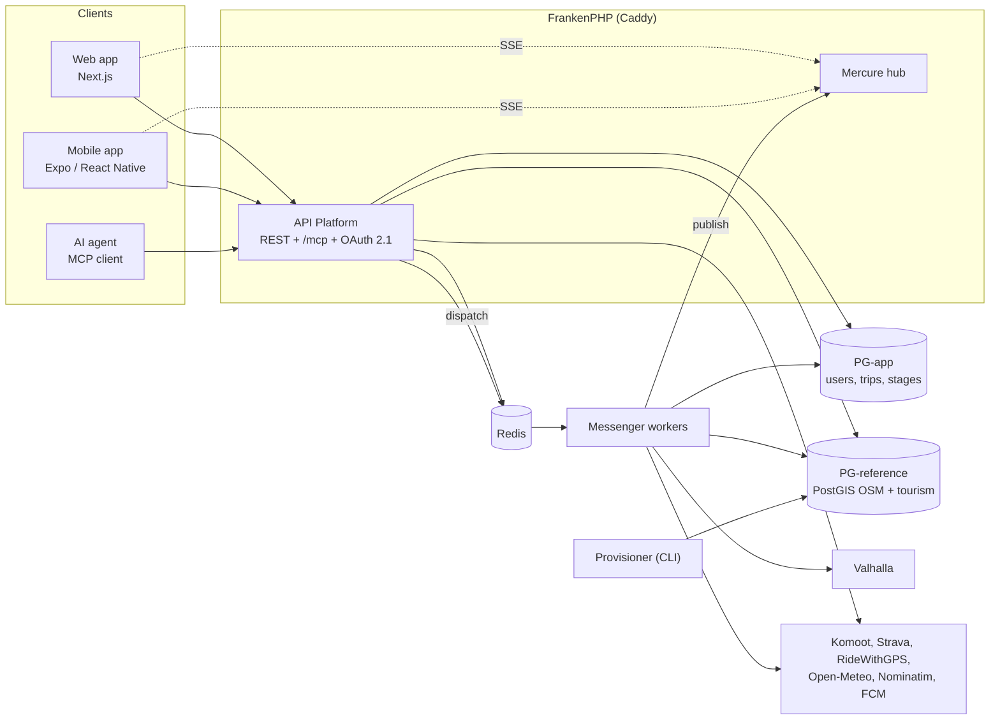

# Architecture

How Bike Trip Planner fits together and why it is built that way. Each section links to the
Architecture Decision Records (ADRs) that hold the full reasoning; the [index](#adr-index) at the
end groups all of them by theme. For what the product does, see [Features](features.md).

## The system at a glance

- **Three clients, one API.** The web app, the native mobile app and AI agents speaking the Model
  Context Protocol all go through the same API Platform operations, with the same providers,
  processors, validation and authorization.
- **A stateless PHP backend** (Symfony, API Platform, PHP 8.5) served by FrankenPHP, whose Caddy
  also hosts the Mercure hub and proxies the web app.
- **Asynchronous workers** (Symfony Messenger over Redis, 2 replicas by default) do the slow work:
  fetching routes, computing stages, scanning the reference data, fetching weather, sending push
  notifications.
- **Two PostgreSQL databases**: PG-app holds what users create, PG-reference holds the read-only
  geographic index. **Redis** holds transient computation state, caches and the Messenger queues.
- **A provisioner** imports reference data out of band; **Valhalla** serves a routing graph built
  out of band.

## Clients

### Web app

Next.js (App Router), React and TypeScript in strict mode. Trip state lives in memory in Zustand
stores with Immer; trip data is not persisted in the browser. The session is a short-lived JWT held in
memory plus an HttpOnly refresh cookie, handled by Next.js route handlers under `/api/auth/*`; the
server resolves the session before rendering, so protected pages are gated server side
([ADR-007](adr/adr-007-frontend-local-state-management-and-reactivity.md),
[ADR-023](adr/adr-023-authentication-strategy.md),
[ADR-047](adr/adr-047-server-side-web-auth-resolution.md)).

### Mobile app

A native Expo / React Native app, replacing the earlier Capacitor wrapper. It authenticates with
Bearer tokens, subscribes to Mercure with an `Authorization` header instead of a cookie, receives
push notifications through Firebase Cloud Messaging, and keeps trips available offline with
automatic resynchronisation
([ADR-053](adr/adr-053-mobile-strategy-native-app.md),
[ADR-054](adr/adr-054-mobile-design-system.md),
[ADR-056](adr/adr-056-mercure-header-auth-non-browser.md),
[ADR-058](adr/adr-058-push-fcm.md),
[ADR-059](adr/adr-059-mobile-offline-auto-sync.md)). See
[Mercure auth for non-browser clients](mobile-mercure-auth.md).

### AI agents (MCP)

The API exposes an MCP server at `/mcp`, built on API Platform's native MCP integration. It is a
third client, not an AI feature inside the product: the server runs no model. Thirteen tools map
to user intents (list, read, create, edit, share, delete trips) and each one reuses existing
operations. Agents authenticate against an OAuth 2.1 authorization server embedded in the API
(`league/oauth2-server`), with PKCE, Client ID Metadata Documents, audience-bound tokens and a
consent screen in the web app. Agent tokens are signed with a different key from session tokens, so
one can never be used as the other. Scopes are checked on every parsed MCP message, calls are rate
limited, and users can see and revoke the applications they authorized
([ADR-063](adr/adr-063-transport-agnostic-authorization.md),
[ADR-064](adr/adr-064-mcp-server-as-third-api-client.md),
[ADR-079](adr/adr-079-authorizing-an-agent-without-giving-it-a-session.md),
[ADR-080](adr/adr-080-thirteen-tools-and-everything-that-is-not-one.md),
[ADR-081](adr/adr-081-what-an-agent-can-make-the-server-believe-say-and-do.md),
[ADR-082](adr/adr-082-the-table-carries-the-dates-the-tokens-carry-the-truth.md)). See
[Connect an AI agent](connect-an-ai-agent.md) and [MCP tools](mcp-tools.md).

AI features inside the product (Ollama, then bring-your-own-token cloud models) existed and were
removed ([ADR-052](adr/adr-052-remove-ai-support.md)).

## One contract for every client

The PHP resources define the schema. API Platform exports it as OpenAPI, `openapi-typescript`
generates `core/schema.d.ts`, and both front ends call the API through `openapi-fetch`. A backend
change that breaks the contract breaks the TypeScript build, and the CI job `openapi-typegen-drift`
fails if the committed types are stale
([ADR-002](adr/adr-002-interface-contract-and-strict-typing.md)).

The generated types live in `@btp/core`, a framework-free npm workspace (the repository is a
`core` / `pwa` / `mobile` monorepo). It also carries the Mercure event types and the pure
reducers that reconcile events into the stores, so a reconciliation fix lands once for both apps
([ADR-055](adr/adr-055-mobile-state-architecture.md)).

## Computing a trip

1. **Ingest.** A GPX upload is parsed in the request with a streaming XMLReader (constant memory,
   DOCTYPE rejected), smoothed and decimated with Douglas-Peucker; a Komoot, Strava or RideWithGPS
   link is fetched by a worker through a host-locked HTTP client
   ([ADR-004](adr/adr-004-spatial-engineering-gpx-parsing-and-data-decimation.md),
   [ADR-011](adr/adr-011-security-input-validation-and-ssrf-prevention-for-gpx-url-ingestion.md)).
   The API answers `202 Accepted` and the rest runs on workers.
2. **Structure.** The pacing engine splits the route into daily stages, and the stages are scanned
   against the local reference index: accommodations, resupply, water, bike shops, stations,
   borders, ferries, fords, cultural points of interest and events. There is no user gate between
   a preview and an analysis any more
   ([ADR-006](adr/adr-006-pacing-engine-and-dynamic-stage-generation-algorithm.md),
   [ADR-043](adr/adr-043-synchronous-structural-computation-async-enrichments.md)).
3. **Enrich.** Network-bound enrichments, weather first, run as separate messages and fill their
   block when they finish.

What makes this robust:

- **Stages keep a stable identity** across recomputations, so an enrichment attached to a stage
  survives the next edit, and enrichments are persisted group by group
  ([ADR-066](adr/adr-066-stable-stage-identity.md),
  [ADR-068](adr/adr-068-enrichment-durability-by-group.md)).
- **Computation state is contract data.** Each category's status is mirrored from Redis into a
  PostgreSQL column and exposed by the API, so a client knows what is pending, done or failed
  whenever it reads the trip ([ADR-072](adr/adr-072-computation-state-is-contract.md)).
- **Each computation declares what invalidates it** (the stage geometry, the stage dates), so an
  edit re-dispatches exactly the computations it made stale
  ([ADR-070](adr/adr-070-freshness-is-dispatch-completeness.md)).
- **Newer work supersedes older work.** Messages carry the trip generation they belong to; a
  superseded computation settles and says so instead of overwriting fresher results
  ([ADR-073](adr/adr-073-supersession-settles-and-says-so.md)).

## Reading a trip

- **Progressive loading.** A trip is read as a light summary, then one detail resource per stage,
  then the route geometry only when a map is shown. Mobile fetches a stage when it is opened; web
  fetches all of them in parallel and fills the timeline row by row
  ([ADR-057](adr/adr-057-progressive-trip-loading.md)).
- **One canonical address.** `/trips/{id}` answers JSON-LD, GPX or FIT depending on the format
  ([ADR-074](adr/adr-074-a-trip-has-an-address.md)).
- **Alerts are rendered at read time.** The database stores an alert's stable `code`, a
  translation key and raw parameters; the sentence is produced in the reader's language when the
  trip is read. Clients key dismissal on the code
  ([ADR-012](adr/adr-012-rule-based-nudge-and-contextual-alert-engine.md),
  [ADR-069](adr/adr-069-alerts-rendered-at-read.md), [Alert engine](alert-engine.md)).

## Persistence: who queries, who flushes

- **Queries live in repositories.** A State provider or processor, a voter or a handler asks a
  repository method named for what it wants (`findPageOwnedBy()`, `isOwnedBy()`, `rotate()`); it
  never builds a query builder, DQL or SQL itself. Raw SQL stays where the statement needs it (a
  compare-and-swap, an insert whose unique violation is the expected outcome), but inside the
  repository.
- **A repository write is complete when the method returns.** Every repository method that
  writes flushes, or executes its own statement, before returning, so no caller has to remember
  a flush after it. A method that only builds an entity for the caller to send first
  (`MagicLinkRepository::issue()`) writes nothing, and the separate method that stores it
  (`save()`) flushes. A `flush()` in a processor or command is for the entities that class
  changed itself.

## Live updates: Mercure as an invalidation channel

Workers publish an event to the trip's topic whenever something changes. Mercure is never the
source of truth: everything an event carries can be read back with an authenticated GET, a client
that missed events resynchronises on its next read, and a hub outage cannot fail the work that
produced the event. The readiness probe therefore reports Mercure without requiring it
([ADR-065](adr/adr-065-mercure-is-an-invalidation-channel.md)). The hub speaks Mercure protocol
1.0; browsers authenticate with an HttpOnly cookie, the mobile app with a header.

## Concurrent edits and retries

- Every trip has a version. Reads return it as an `ETag`; edits must send `If-Match`, and get
  `428` without it or `412` when the trip has moved in between
  ([ADR-067](adr/adr-067-optimistic-concurrency-on-trip-edits.md),
  [ADR-078](adr/adr-078-what-an-etag-promises.md)).
- What an edit changed, and therefore what must be recomputed, is read by comparing the resource
  before and after the request, never from a cached fingerprint
  ([ADR-076](adr/adr-076-the-state-before-is-the-record.md)).
- A creation carries an `Idempotency-Key`, so a retried request does not create a second trip
  ([ADR-077](adr/adr-077-a-creation-carries-its-own-key.md)).
- A resource the caller may not see answers `404`, never `403`
  ([ADR-038](adr/adr-038-hide-forbidden-as-not-found.md)).

## Reference data and routing

OpenStreetMap features and tourism data (DataTourisme, OpenAgenda) are imported by the
provisioner into PG-reference, and the API queries them with spatial SQL. There is no runtime
Overpass dependency
([ADR-040](adr/adr-040-local-first-reference-data-postgis.md),
[ADR-025](adr/adr-025-removal-of-self-hosted-overpass.md)).

- **Two datasets, two calendars.** Reference data is opened one region per run
  (`make provision <zone>`); rows that no resolver can complete are rejected at import time, and
  nothing imported is ever overwritten. The routing graph is national and built separately
  (`make routing-build <country>`); Valhalla only serves it. The routing perimeter must contain
  the reference perimeter
  ([ADR-049](adr/adr-049-zone-opening-and-import-time-completeness.md),
  [ADR-036](adr/adr-036-manual-osm-data-refresh.md)).
- **Events are the exception**: perishable, they are refreshed on a schedule and purged once past
  ([ADR-051](adr/adr-051-multi-source-events-openagenda-temporal-lifecycle.md)).
- **PG-reference is separate from PG-app.** In production it is one shared read-only instance
  used by every stack; in development and CI a single PostgreSQL backs both connections. A
  computed trip is frozen into its stages, so it still renders if the reference rows disappear
  ([ADR-060](adr/adr-060-pg-split-app-reference.md)).
- Valhalla is only used to reroute a stage end to a chosen accommodation or point of interest
  ([ADR-017](adr/adr-017-valhalla-routing-engine-and-self-hosted-overpass-integration.md)).

## Deployment and operations

Development and production run the same FrankenPHP image
([ADR-037](adr/adr-037-docker-dev-prod-convergence.md)). Production is one Oracle Cloud ARM VM
provisioned by Ansible, reached through a Cloudflare Tunnel and Traefik, and deployed by GitHub
Actions over SSH on each `v*` tag, with a preview per pull request
([ADR-061](adr/adr-061-deployment-ansible-gha-ssh-traefik-tunnel.md)). PG-app is backed up nightly
off the VM ([ADR-062](adr/adr-062-backup-and-disaster-recovery.md)). `/api/health` turns `503`
when no worker is consuming messages, since nothing the API accepts would then complete
([ADR-075](adr/adr-075-readiness-covers-the-consumers.md)). See [Deployment](deployment.md) and
the [runbooks](runbooks/README.md).

## ADR index

Superseded, revoked and withdrawn ADRs are kept for history and marked as such.

**Foundations and tooling**

- [ADR-001](adr/adr-001-global-architecture-and-separation-of-concerns.md) Global architecture and separation of concerns
- [ADR-002](adr/adr-002-interface-contract-and-strict-typing.md) Interface contract and strict typing
- [ADR-003](adr/adr-003-local-first-data-persistence-versioning-and-migrations.md) Local-first data persistence, versioning and migrations
- [ADR-007](adr/adr-007-frontend-local-state-management-and-reactivity.md) Frontend local state management (Zustand)
- [ADR-009](adr/adr-009-quality-assurance-and-automated-testing-strategy.md) Quality assurance and automated testing
- [ADR-010](adr/adr-010-developer-experience-task-automation-and-local-infrastructure.md) Developer experience and local infrastructure
- [ADR-037](adr/adr-037-docker-dev-prod-convergence.md) Dev/prod Docker convergence on FrankenPHP
- [ADR-071](adr/adr-071-dependency-version-policy-and-ceilings.md) Dependency version policy and ceilings

**Trip computation**

- [ADR-004](adr/adr-004-spatial-engineering-gpx-parsing-and-data-decimation.md) GPX parsing and decimation
- [ADR-006](adr/adr-006-pacing-engine-and-dynamic-stage-generation-algorithm.md) Pacing engine and stage generation
- [ADR-016](adr/adr-016-performance-optimization-strategy.md) Performance of the async pipeline
- [ADR-027](adr/adr-027-gate-mechanism-two-phase-pipeline.md) Two-phase pipeline (superseded by ADR-043)
- [ADR-043](adr/adr-043-synchronous-structural-computation-async-enrichments.md) Structural computation without a gate, async enrichments
- [ADR-066](adr/adr-066-stable-stage-identity.md) Stable stage identity
- [ADR-067](adr/adr-067-optimistic-concurrency-on-trip-edits.md) Optimistic concurrency on trip edits
- [ADR-068](adr/adr-068-enrichment-durability-by-group.md) Enrichment durability, by group
- [ADR-070](adr/adr-070-freshness-is-dispatch-completeness.md) Freshness is dispatch completeness
- [ADR-072](adr/adr-072-computation-state-is-contract.md) Computation state is part of the contract
- [ADR-073](adr/adr-073-supersession-settles-and-says-so.md) Supersession settles, and says so
- [ADR-076](adr/adr-076-the-state-before-is-the-record.md) The state before the request is the record
- [ADR-077](adr/adr-077-a-creation-carries-its-own-key.md) A creation carries its own key

**Reading and live updates**

- [ADR-055](adr/adr-055-mobile-state-architecture.md) Thin stores composing `@btp/core`
- [ADR-057](adr/adr-057-progressive-trip-loading.md) Progressive trip loading
- [ADR-065](adr/adr-065-mercure-is-an-invalidation-channel.md) Mercure is an invalidation channel
- [ADR-069](adr/adr-069-alerts-rendered-at-read.md) Alerts rendered at read time
- [ADR-074](adr/adr-074-a-trip-has-an-address.md) A trip has an address
- [ADR-078](adr/adr-078-what-an-etag-promises.md) What an ETag promises

**Alerts and enrichments**

- [ADR-012](adr/adr-012-rule-based-nudge-and-contextual-alert-engine.md) Rule-based alert engine
- [ADR-013](adr/adr-013-accomodation-discovery-and-heuristic-pricing-strategy.md) Accommodation discovery and heuristic pricing
- [ADR-014](adr/adr-014-alert-extensibility.md) Alert extensibility
- [ADR-015](adr/adr-015-dynamic-engine-management-design-pattern.md) Dynamic engine management
- [ADR-026](adr/adr-026-multi-source-data-integration.md) Multi-source data integration (partially superseded by ADR-044)
- [ADR-044](adr/adr-044-removal-of-data-gouv-markets-source.md) Removal of the data.gouv.fr markets source
- [ADR-048](adr/adr-048-in-ride-assistance-without-ai.md) In-ride assistance without AI
- [ADR-051](adr/adr-051-multi-source-events-openagenda-temporal-lifecycle.md) Multi-source events and their lifecycle

**Reference data and routing**

- [ADR-005](adr/adr-005-orchestration-optimization-and-caching-of-external-apis.md) Caching of external APIs
- [ADR-017](adr/adr-017-valhalla-routing-engine-and-self-hosted-overpass-integration.md) Valhalla routing (its Overpass part superseded by ADR-025)
- [ADR-020](adr/adr-020-dynamic-overpass-region-provisioning.md) Dynamic Overpass region provisioning (superseded)
- [ADR-025](adr/adr-025-removal-of-self-hosted-overpass.md) Removal of self-hosted Overpass
- [ADR-033](adr/adr-033-osm-data-refresh-strategy.md) Nightly OSM refresh (superseded by ADR-036)
- [ADR-036](adr/adr-036-manual-osm-data-refresh.md) Manual OSM data refresh
- [ADR-040](adr/adr-040-local-first-reference-data-postgis.md) Local-first reference data in PostGIS
- [ADR-041](adr/adr-041-provisioner-resilience.md) Provisioner resilience
- [ADR-049](adr/adr-049-zone-opening-and-import-time-completeness.md) Zone opening and import-time completeness
- [ADR-050](adr/adr-050-terrain-attribution-to-the-ridden-route.md) Terrain attribution to the ridden route
- [ADR-060](adr/adr-060-pg-split-app-reference.md) PG-app / PG-reference split

**Export**

- [ADR-008](adr/adr-008-high-fidelity-pdf-readbook-generation-strategy.md) PDF roadbook (revoked)
- [ADR-018](adr/adr-018-garmin-export-and-device-sync-strategy.md) Garmin export and device sync
- [ADR-021](adr/adr-021-enriched-gpx-export-with-waypoints.md) Enriched GPX export with waypoints

**Authentication, access and privacy**

- [ADR-023](adr/adr-023-authentication-strategy.md) Passwordless magic link with JWT
- [ADR-029](adr/adr-029-early-access-system.md) Early access system
- [ADR-034](adr/adr-034-usage-analytics-plausible.md) Usage analytics (Plausible)
- [ADR-035](adr/adr-035-rgpd-account-erasure.md) GDPR account erasure and portability
- [ADR-038](adr/adr-038-hide-forbidden-as-not-found.md) Hide forbidden resources as 404
- [ADR-047](adr/adr-047-server-side-web-auth-resolution.md) Server-side web auth resolution
- [ADR-063](adr/adr-063-transport-agnostic-authorization.md) Transport-agnostic authorization

**MCP server**

- [ADR-064](adr/adr-064-mcp-server-as-third-api-client.md) MCP server as a third API client
- [ADR-079](adr/adr-079-authorizing-an-agent-without-giving-it-a-session.md) Authorizing an agent without giving it a session
- [ADR-080](adr/adr-080-thirteen-tools-and-everything-that-is-not-one.md) Thirteen tools, and everything that is not one
- [ADR-081](adr/adr-081-what-an-agent-can-make-the-server-believe-say-and-do.md) What an agent can make the server believe, say and do
- [ADR-082](adr/adr-082-the-table-carries-the-dates-the-tokens-carry-the-truth.md) Authorized applications: the table carries the dates, the tokens the truth

**Mobile**

- [ADR-024](adr/adr-024-mobile-strategy-capacitor.md) Capacitor Android wrapper (superseded by ADR-053)
- [ADR-053](adr/adr-053-mobile-strategy-native-app.md) Dedicated native app
- [ADR-054](adr/adr-054-mobile-design-system.md) Mobile design system
- [ADR-056](adr/adr-056-mercure-header-auth-non-browser.md) Mercure header auth for non-browser clients
- [ADR-058](adr/adr-058-push-fcm.md) Push notifications via FCM
- [ADR-059](adr/adr-059-mobile-offline-auto-sync.md) Offline auto-sync

**Infrastructure and operations**

- [ADR-019](adr/adr-019-deployment-infrastructure-strategy.md) Deployment infrastructure (amended by ADR-061)
- [ADR-022](adr/adr-022-persistent-storage-strategy.md) Persistent storage
- [ADR-031](adr/adr-031-error-tracking-strategy.md) Error tracking
- [ADR-032](adr/adr-032-migrations-and-rollback-strategy.md) Migrations and rollback
- [ADR-039](adr/adr-039-beta-right-sizing-free-tier.md) Beta right-sizing on the free tier
- [ADR-061](adr/adr-061-deployment-ansible-gha-ssh-traefik-tunnel.md) Ansible, GitHub Actions over SSH, Traefik and Cloudflare Tunnel
- [ADR-062](adr/adr-062-backup-and-disaster-recovery.md) Backup and disaster recovery
- [ADR-075](adr/adr-075-readiness-covers-the-consumers.md) Readiness covers the consumers

**Security**

- [ADR-011](adr/adr-011-security-input-validation-and-ssrf-prevention-for-gpx-url-ingestion.md) Input validation and SSRF prevention

**Withdrawn AI features** (all withdrawn by ADR-052)

- [ADR-028](adr/adr-028-ollama-llama-integration.md) Ollama / LLaMA integration
- [ADR-030](adr/adr-030-symfony-ai-adoption.md) symfony/ai adoption
- [ADR-042](adr/adr-042-optional-multi-provider-ai-byo-token.md) Multi-provider AI on a bring-your-own token
- [ADR-045](adr/adr-045-conversational-ai-trip-brief-chat.md) Conversational trip-brief chat
- [ADR-046](adr/adr-046-temporary-ai-feature-flag.md) AI feature flag
- [ADR-052](adr/adr-052-remove-ai-support.md) Remove AI support
