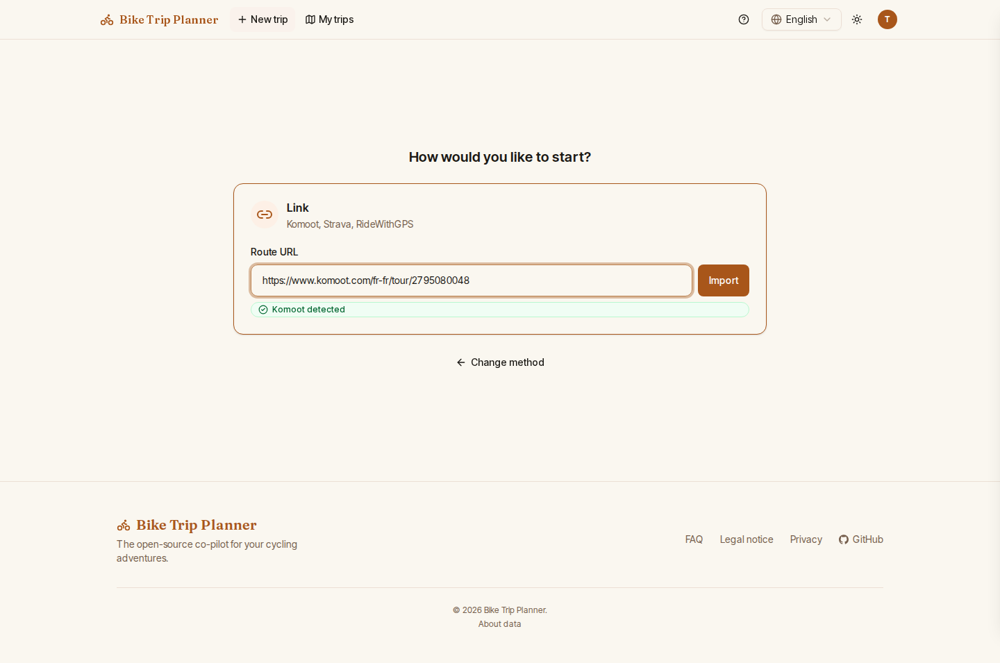
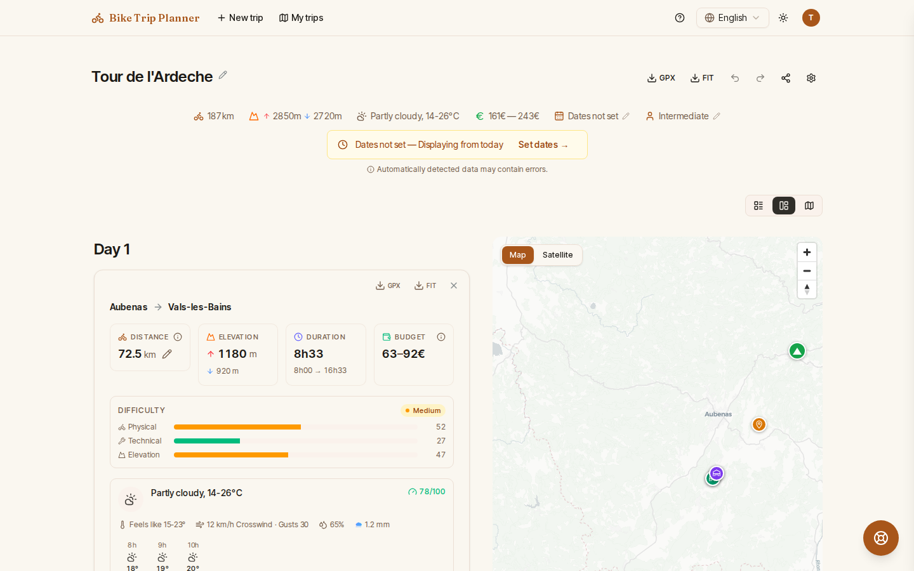
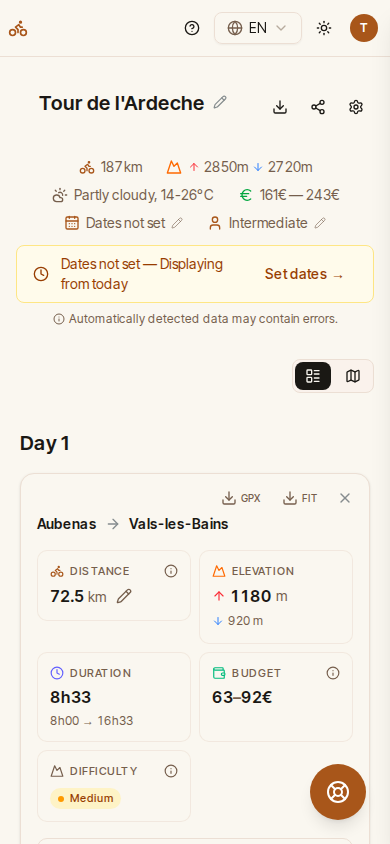
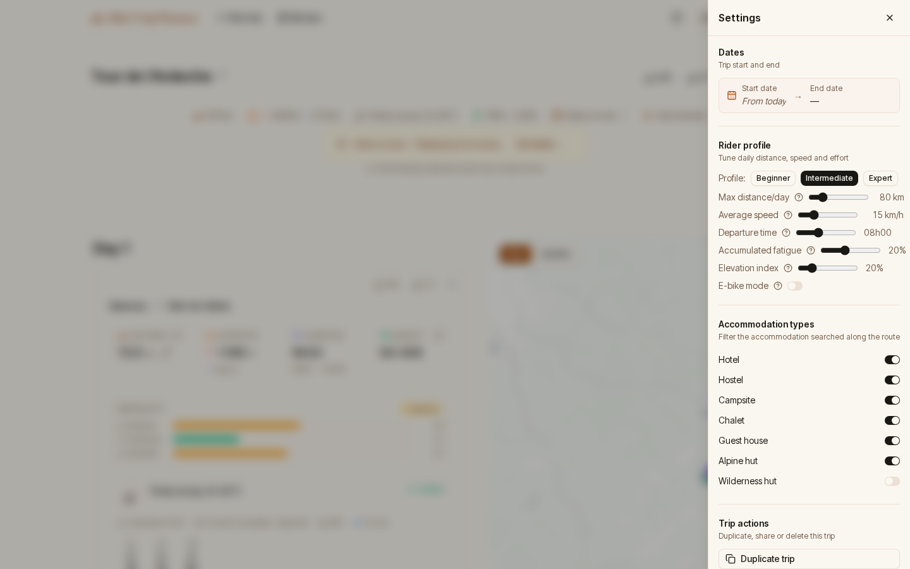
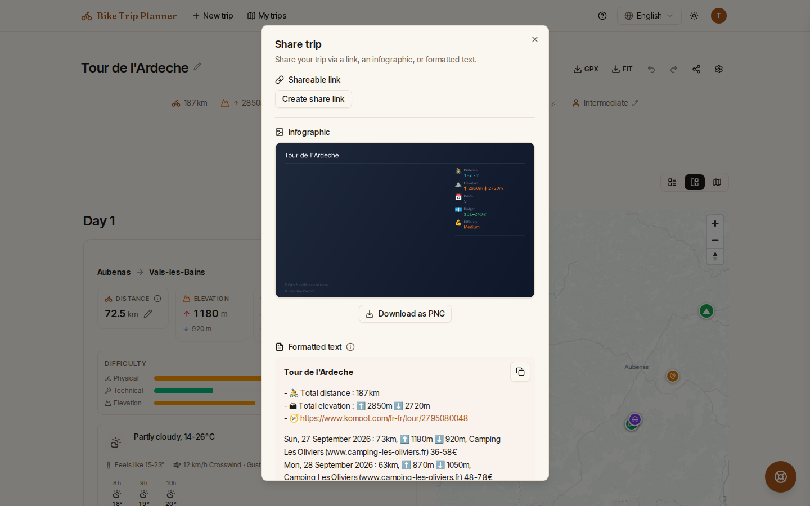

# Plan your first trip

In this tutorial you turn a route into a day-by-day roadbook in the web app: you sign in,
import a route, read the stages, adjust them to your pace, and export the result to your
GPS. It takes about ten minutes.

You need:

- an account (Bike Trip Planner is in private beta: if you do not have one yet, use
  **Request early access** on the home page and wait for your invitation);
- a route: a public Komoot tour or collection, a Strava route, a RideWithGPS route, or a
  `.gpx` file (up to 30 MB). The route should lie in the covered area (France, Belgium,
  the Netherlands, Luxembourg).

## 1. Sign in with a magic link

1. Open the app and click **Sign in**.
2. Enter your email address and click **Send sign-in link**.
3. Open the email and click the link. It is valid for 30 minutes; if it has expired,
   click **Request a new link**.

There is no password. You land on the trip creation screen.

## 2. Import a route

The screen asks **How would you like to start?** and offers two cards.

To import from a platform:

1. Click the **Link** card.
2. Paste the URL into **Route URL**, for example `https://www.komoot.com/tour/123456789`.
   A chip confirms the source (**Komoot detected**, **Strava detected**,
   **RideWithGPS detected**); an unsupported address shows **Unsupported URL**.
3. Click **Import**.

To import a file instead, click the **GPX file** card and drop your `.gpx` file on it, or
click **Browse**. You can also drop a GPX file anywhere on the page.

A loader shows while the route is fetched and split into stages. As soon as the stages
exist, the trip opens at its own address (`/trips/<id>`) and is saved to **My trips**.
Points of interest, accommodations, weather and alerts keep arriving for a few seconds:
each section fills in on its own, there is nothing to refresh.

## 3. Read the roadbook

At the top, the summary gives the total distance and elevation, the dates and the
**Estimated budget**. Below it, the roadbook lists one card per day.

For each stage, the card shows:

- **distance, elevation and estimated departure and arrival times**, a difficulty rating
  and the surface breakdown;
- the **weather** for that day (temperature, feels-like, rain, wind relative to your
  direction of travel, sunrise and sunset), with an **Hourly weather** table. Forecasts
  are available up to 16 days ahead;
- the **water points and shops** along the way;
- **Alerts**, from critical to informational: steep climbs, busy roads, rough surfaces,
  headwind, arrival after dark, no resupply, ferries, fords and more. See the
  [alert engine](alert-engine.md) for the full list. **Cultural recommendations** close
  to the route come with an **Add to itinerary** button that routes the stage through
  them;
- **accommodations** found around the stage end point, with an estimated price. Click
  **Select accommodation** on the one you plan to book; it feeds the budget. If nothing
  suits you, click **Expand search to ... km** or **Add accommodation** to enter your own;
- local **events** on that day, and **Download GPX** / **Download FIT** buttons for the
  stage.

Use the view switch above the roadbook to choose **Timeline only**, **Map only** or the
**Split view**. The map carries an elevation profile; click a stage on it to jump to its
card. On a phone, the roadbook shows as a single timeline:

{ width="320" }

## 4. Adjust the trip

### Set your dates

Click **Set dates** in the banner (or **Edit dates** in the summary) and pick the start
and end dates. The trip is re-split into one stage per day, and the weather and calendar
alerts (Sundays, public holidays) follow the real dates. Without dates, the planner
shows the trip as if it started today, with as many stages as your maximum daily
distance requires.

### Tune your rider profile

Click the **Open settings** (gear) button next to the trip title. Under
**Rider profile**:

- pick a preset: **Beginner**, **Intermediate** or **Expert**;
- or set each value: **Max distance/day**, **Average speed**, **Accumulated fatigue**
  (each day is shorter than the previous one by this percentage), **Elevation index**
  (how much climbing shortens a stage), **Departure time**;
- switch on **E-bike mode** to get battery-range alerts.

Under **Accommodation types**, untick the kinds of places you do not want suggested.

### Edit individual stages

- **Edit distance** on a stage changes that day's mileage; the rest of the trip is
  re-split around it.
- **Add stage** splits the trip further (at least 5 km per stage); the delete button
  removes a stage (a trip keeps at least 2).
- **Add rest day** inserts a day off after a stage.
- Search a stage's departure or arrival to move it to a named place.

Every change can be undone with **Undo** (Ctrl+Z) and redone with **Redo** (Ctrl+Y).

## 5. Export and share

- To load the whole trip on your GPS, use **Download full trip GPX** or
  **Download full trip FIT** next to the trip title. For one day only, use the buttons on
  that stage's card. Files carry waypoints for the water points, shops and
  accommodations.
- To show the trip to someone, click **Share trip**, then **Create share link**. The link
  gives read-only access, and **Revoke link** cuts it at any time. The same dialog lets you
  **Download as PNG** an infographic or **Copy text** of a formatted summary.

## What you have done

You imported a route, read its stages, alerts, accommodations and weather, fitted the
plan to your dates and pace, and exported it. From here:

- once on the road, the in-ride help button answers "where can I find water / shelter /
  food / a bike shop...?" around your position;
- the [native mobile app](features.md#mobile-app) keeps upcoming trips available offline;
- an AI assistant can plan and edit trips for you: see
  [Connect an AI agent](connect-an-ai-agent.md).

A trip that has started or is in the past becomes read-only; use **Duplicate trip** in the
settings to plan a new variant. The [features reference](features.md) lists everything
else the planner does.
